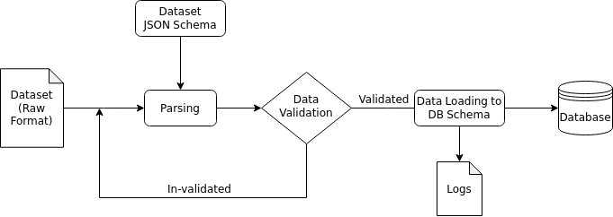

# Data Ingestion - Cognition and Ageing (Healthcare)

## Team-3 : DontKnow

- Adhiraj Deshmukh - `2021121012`
- Puneeth Sai Tumbalabeedu - `2019101064`

---

## Project Description

When dealing with Medical Data, the size of the datasets are in TBs and thus its not feasible to store off it a local storage, thus its really hard to work on these datasets as a whole. Data Foundation System enables the users of the dataset to store these datasets on the DFS system and enable them to query on multiple datasets having similar attributes without revealing the identity of the Medical Data.

For this system to work, Data Ingestion system is very essential. 
Specifically our task deals with designing a generic data ingestion system, which can be used to ingest data from multiple sources and stored in a generic way, which allows these attributes to be queried seperately with different types of dataset.

The user can input multiple datype of data, which can vary in size, type, and use cases, and the system in expected to be able to parse excel sheets, CSVs, and other data formats, which may be stored in a hierarchical, segmented, or single-file fashion.
The system will contain a novel JSON schema that can be generated without understanding the data, but will maintain enough context to allow for a near one-one mapping to a DB schema.

---

## Functional Requirements

This projected is divided into 3 parts, each having its independent functionality:
- JSON Schema
- Parsing and Validation
- Data Loading

### 1. JSON Schema

The first task is to create JSON Schema such that it can be be mapped to a DB schema, and it should wok for most generic data systems, taking into accound databases with multiple fields, constraints, varying relationships mong fields and tables.

The schema should contain enough metadata in order to provide suitable scope for loading phase, specifying the number of tables, rows, and overall structure. Also, there should be abstract representation of tables in the JSON format.

### 2. Parsing and Validation

This tasks involves parsing the row data of various formats, with respect to the JSON schema, along with basic data and system validations. This stage is necessary for monitoring any top-level faults that may occur during the generic data loading process.

For parsing the data, files are loaded, varying as per their format, and then are cross-checked with the JSON schema for any faults.

In the validation pahse, if there are any critical breaking errors, like absence of table, realation, or key/field mismatch, appropriate errors will be logged.

### 3. Data Loading

The loading phase of the project involves generating a data loader, that is able to sequentially load the entire raw data, and adapt it to the generated DB schema. This data is simultaneously outputted to the final DB, and logs for this process are maintained. Upon completion, a summary of this process, containing the final schema, execution logs, and other details, will be generated. At the end of this step, user is able to obtain a final DB fro mtheir raw data and JSON schema.
